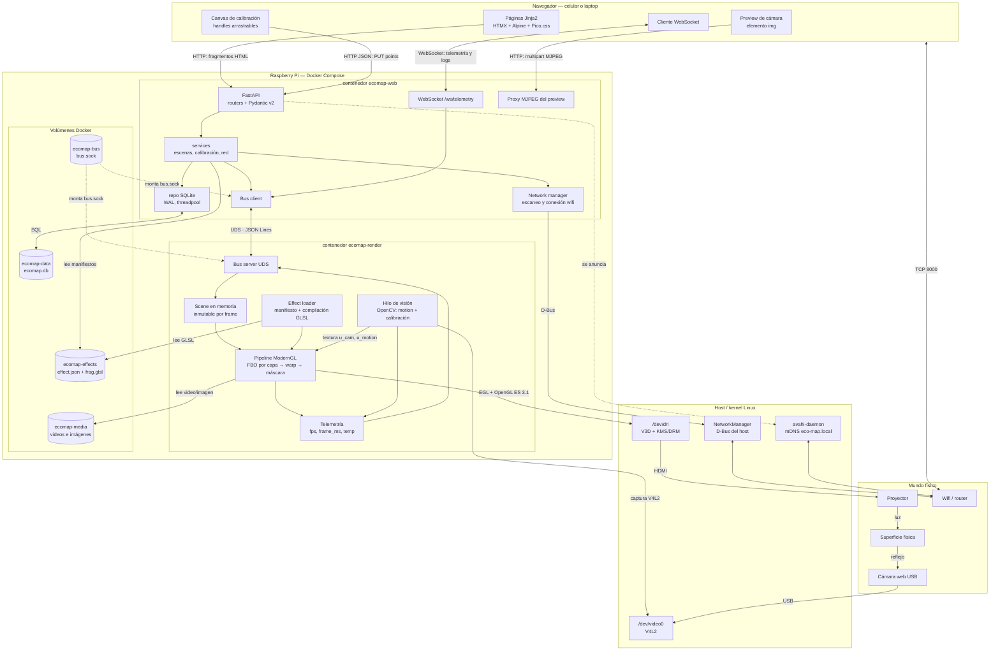
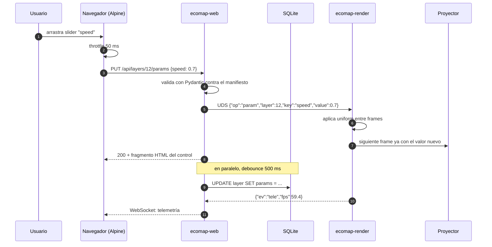
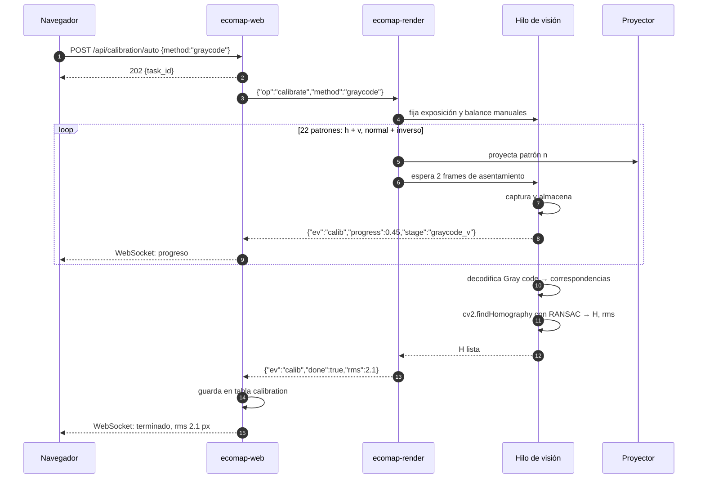

# Arquitectura general

## Principios estructurales

1. **Dos procesos**: web (FastAPI) y render (ModernGL). Ver [[ADR-006-IPC-Web-Render]].
2. **Todo corre en contenedores**, también en la Raspberry Pi. Ver [[ADR-009-Todo-en-Contenedores]].
3. **SQLite es persistencia, el socket es tiempo real.** El render nunca abre la DB.
4. **Los efectos son archivos**, no código Python ni filas grandes en la DB. Ver [[ADR-011-Archivos-vs-DB]].

## Diagrama de componentes

El **lazo cerrado** es la parte interesante: `GLP → DRI → HDMI → Proyector → Superficie → Cámara → V4L2 → CAMT → GLP`. Eso es la retroalimentación, y también el riesgo de realimentación positiva descrito en [[Modulo-Camara-Feedback]].

## Secuencia — mover un slider (CU-04)

Latencia percibida = throttle + HTTP local + un frame ≈ **60–80 ms**, dentro de RNF-2. La escritura a disco queda fuera del camino crítico: protege la SD y no agrega latencia. Ver [[ADR-004-SQLite]].

## Secuencia — auto-calibración con cámara (CU-03)

Si `rms` supera el umbral, la UI lo reporta y ofrece calibración manual. Ver [[Modulo-Calibracion]].

## Reparto de responsabilidades

| | ecomap-web | ecomap-render |
|---|---|---|
| Dueño de | SQLite, HTTP, WebSocket, red | contexto GL, HDMI, cámara |
| Ritmo | por petición | 60 fps |
| Si se cae | la proyección **sigue** | la UI muestra "render offline" |
| Reinicio | instantáneo, sin cortar la luz | ~2 s de negro |

Relacionado: [[Modulo-Web-API]] · [[Modulo-Render]] · [[Modulo-Red]] · [[Estructura-Repositorio]] · [[Presupuesto-de-Rendimiento]] · [[Eco-Map]]
