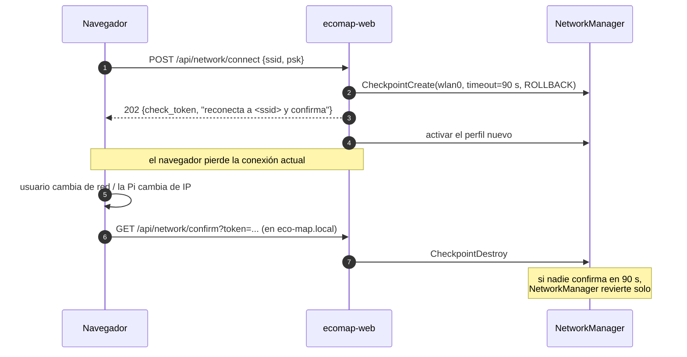

# Módulo Red

Configurar el wifi de la Pi **desde la propia interfaz web**, sin teclado ni monitor: escanear redes, conectarse, ver el estado, y publicar `eco-map.local` por mDNS.

## El problema de fondo

Es un caso con una trampa clásica: **para configurar la red hay que usar la red**. Si el usuario se conecta al AP de la Pi, elige su wifi y la Pi cambia de red, el navegador se queda sin servidor y no hay forma de saber si funcionó. Todo el diseño gira alrededor de eso.

## Decisión de implementación

El host corre **NetworkManager** (default en Raspberry Pi OS Bookworm). El contenedor web lo controla por **D-Bus del sistema**:

```yaml
# docker-compose.pi.yml (fragmento)
web:
  network_mode: host
  volumes:
    - /run/dbus/system_bus_socket:/run/dbus/system_bus_socket
```

Dentro del contenedor, dos caminos:

| Vía | Pros | Contras |
|---|---|---|
| **`nmcli`** (paquete `network-manager` en la imagen) | trivial de implementar y depurar | ~30 MB extra, parseo de texto |
| **D-Bus directo** (`sdbus`/`dbus-fast` a `org.freedesktop.NetworkManager`) | sin parseo, señales de cambio de estado, acceso a **Checkpoints** | más código |

**v1: `nmcli` con salida tabular** (`nmcli -t -f ...`, separador `:`), porque desbloquea rápido. **v1.1: migrar a D-Bus** para poder usar checkpoints, que es lo que hace segura la operación (ver abajo). El módulo se escribe detrás de una interfaz `NetworkBackend` para que el cambio no toque los routers.

## Operaciones

```
GET  /api/network/status      -> {mode, ssid, ip, signal, internet: bool, ap_active}
POST /api/network/scan        -> 202, escaneo asíncrono (tarda 3-8 s)
GET  /api/network/networks    -> [{ssid, signal, security, saved, in_use}]
POST /api/network/connect     -> {ssid, psk?, hidden?}  · con rollback
POST /api/network/forget      -> {ssid}
POST /api/network/ap          -> {on: true|false}
GET  /api/network/confirm     -> el cliente confirma que la nueva red funciona
```

Comandos equivalentes en `nmcli`:

```bash
nmcli -t -f SSID,SIGNAL,SECURITY,IN-USE device wifi list --rescan yes
nmcli device wifi connect "<ssid>" password "<psk>" ifname wlan0
nmcli -t -f NAME connection show
nmcli connection delete "<ssid>"
nmcli device wifi hotspot ifname wlan0 ssid eco-map-setup password "<psk>"
```

## Conexión con rollback (lo importante)



Con `nmcli` puro no hay checkpoints; el sustituto de v1 es un **watchdog propio**: guardar el perfil anterior, lanzar un temporizador de 90 s y, si no llega `/confirm`, reactivar el perfil viejo. Funciona, pero no sobrevive a un reinicio del contenedor a mitad — por eso se planifica la migración a D-Bus.

## Modo AP de rescate

Al arrancar: si en **45 s** no hay conexión wifi activa, levantar hotspot `eco-map-setup` (WPA2, clave por defecto en `setting`, obligatorio cambiarla). La Pi queda en `192.168.50.1:8000`. Cuando el usuario conecta una red real y confirma, el AP se apaga. Si esa red desaparece, el AP vuelve solo.

**El modo AP no debe apagar la proyección.** El render es un proceso aparte y no depende de la red. Ver [[Arquitectura-General]].

## mDNS

`avahi-daemon` en el host publica `eco-map.local`. Con `network_mode: host` el contenedor web es alcanzable en ese nombre sin hacer nada. Se fija `hostname eco-map` en la Pi. En Android el soporte de mDNS es irregular: la UI **siempre** muestra también la IP numérica, y el modo AP tiene IP fija justamente por eso.

## Seguridad

- La PSK va a NetworkManager y **nunca** a `ecomap.db` ni al log. En los logs, `psk` se enmascara.
- `GET /api/network/networks` revela las redes vecinas: es información de reconocimiento. Aceptado en red local; primer candidato a proteger cuando se agregue auth. Ver [[Seguridad-y-Red]].
- Montar el bus de D-Bus del sistema le da al contenedor web control sobre la red del host. Es la elevación de privilegio más grande del diseño, y está aislada en este módulo. Ver [[ADR-009-Todo-en-Contenedores]].
- Endpoints de red con rate limit: reintentos de PSK a ciegas son un ataque plausible desde la misma LAN.

## UI

Pantalla `/settings/network`: estado actual arriba, lista de redes con intensidad y candado, formulario de clave en línea (HTMX), y un aviso explícito antes de conectar: *"vas a perder esta conexión; reconéctate a la red X y volvé a entrar a eco-map.local"*.

Relacionado: [[Seguridad-y-Red]] · [[Modulo-Web-API]] · [[Despliegue-Raspberry]] · [[Contratos-API]]
